# CSE 15L Lab Report 4
## Table of Contents
- [My markdown-parse repository](#my-repo)
- [The markdown-parse repository I reviewed](#review-repo)
- [Testing snippet1.md](#s1-test)
   - [Running my test on my markdown-parse](#s1-mine)
   - [Fixing my markdown-parse](#s1-fix)
   - [Running my test on the markdown-parse I reviewed](#s1-review)
- [Testing snippet2.md](#s2-test)
   - [Running my test on my markdown-parse](#s2-mine)
   - [Fixing my markdown-parse](#s2-fix)
   - [Running my test on the markdown-parse I reviewed](#s2-review)
- [Testing snippet3.md](#s3-test)
   - [Running my test on my markdown-parse](#s3-mine)
   - [Fixing my markdown-parse](#s3-fix)
   - [Running my test on the markdown-parse I reviewed](#s3-review)

<h2 id="my-repo"> My markdown-parse repository</h2>

You can find my markdown-parse repository [here](https://github.com/Akhil841/markdown-parse).
<h2 id="review-repo"> The markdown-parse repository I reviewed</h2>

You can find the markdown-parse repository I reviewed [here](https://github.com/LippsVega/markdown-parse).
<h2 id="s1-test">Testing snippet1.md</h2>

When I used the VSCode Preview feature on `snippet1.md`, it showed the following:<br>
![The output for snippet1.md. It shows "a link", followed by "url.com" in parentheses, followed by a hyperlink "another link", linking to "`google.com", another hyperlink "cod[e]" without the closing parenthesis, linking to google.com, and lastly cod[e] without the opening parenthesis, linking to ucsd.edu](lr4-snippet-1.png)<br>
Analyzing the links in Visual Studio Code, I found that the first line was not a link, the second link led to 
```
`google.com 
```
(Due to how formatting code works in Markdown, I had to display this URL on its own line rather than inline code), the third link led to `google.com`, and the last link led to `ucsd.edu`. So I would expect `MarkdownParse.getLinks(String)` to return a `List<String>` of 
```
{ "`google.com", "google.com", "ucsd.edu" }
``` 
and I made my test for that reflect it accordingly.<br>
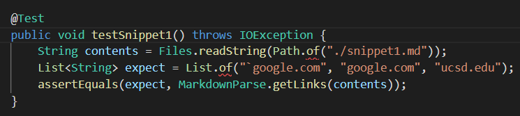<br>
I used this test for both my own MarkdownParse implementation and for the one I reviewed.
<h3 id="s1-mine"> Running the test on my markdown-parse</h3>

When I ran this test on my own implementation of markdown-parse, it failed:<br>
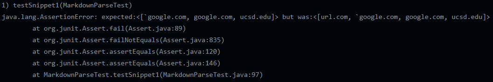
My implementation of markdown-parse returned 
```
{ "url.com" , "`google.com", "google.com", "ucsd.edu"}
```
So it retured everything it was expected to, except it also returned `url.com`, which it shouldn't have.
<h3 id="s1-fix"> Fixing my markdown-parse</h3>

To fix this error, we can add a simple statement to advance past any text in backticks that is also before closed square brackets. This would only take a couple extra lines of code and solve the problem.
<h3 id="s1-review"> Running the test on the markdown-parse I reviewed</h3>

When I ran this test on the markdown-parse I reviewed, the test failed:<br>
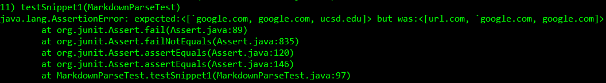<br>
Their implementation of markdown-parse returned
```
{ "url.com", "`google.com", "google.com" }
```
It returned `url.com`, which it was not supposed to return, and did not return `ucsd.edu` like it was supposed to. It did parse the other links properly, though.
<h2 id="s2-test"> Testing snippet2.md</h2>

When I used the VSCode Preview feature on `snippet2.md`, it returned the following:<br>
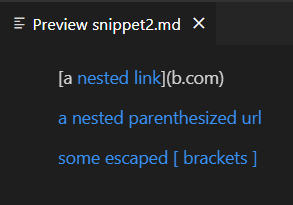<br>
The links lead to `a.com`, `a.com(())`, and `example.com`.<br>
As such, I expected `MarkdownParse.getLinks(String)` to return
```
{ "a.com", "a.com(())", "example.com" }
```
so I wrote my test accordingly:<br>
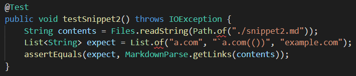
<h3 id="s2-mine"> Running the test on my markdown-parse</h3>

When I ran the test on my markdown-parse, it failed:<br>
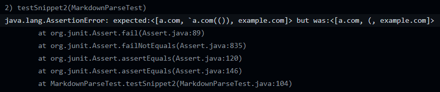<br>
Instead of what was expected, my program returned
```
{ "a.com", "(", "example.com" }
```
All the necessary URLs were returned, and no extraneous URLs were returned. The issue is, however, that my markdown-parse was unable to parse `a.com(())` properly, instead merely returning `(`.
<h3 id="s2-fix">Fixing my markdown-parse</h3>

Fixing this error will be a more commited change than simply adding less than 10 lines of code. We will have to keep track of all open and closed parentheses in the URL to determine where the closing parenthesis that ends the link string is to get the linked URL. This would be pretty difficult and would definitely take more than 10 lines of code to do. It's not even worth the effort since valid URLs don't have parentheses in them.
<h3 id="s2-review"> Running the test on the markdown-parse I reviewed</h3>

When I ran this test on the markdown-parse I reviewed, the test failed:<br>
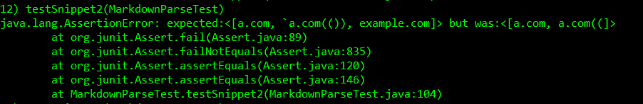
It didn't catch `example.com`, and didn't properly parse `a.com(())`. However, the way it parsed `a.com(())` was much better than how my markdown-parse did.
<h2 id="s3-test">Testing snippet3.md</h2>

When I used the VSCode Preview feature on `snippet3.md`, it returned the following:
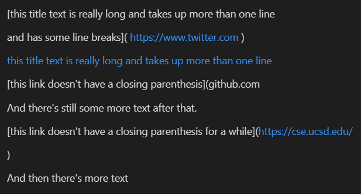<br>
The links lead to `https://www.twitter.com`, `https://ucsd-cse15l-w22.github.io/`, and `https://cse.ucsd.edu/`.<br> 
I thus expected `MarkdownParse.getLinks(String)` to return
```
{ "https://www.twitter.com", "https://ucsd-cse15l-w22.github.io/", "https://cse.ucsd.edu/" }
``` 
so I made my my test accordingly:
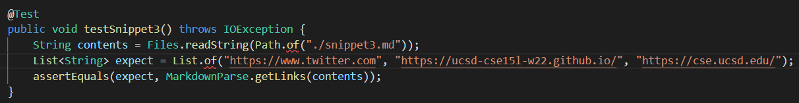
<h3 id="s3-mine">Running the test on my markdown-parse</h3>

When I ran the test on my markdown-parse, it failed:<br>
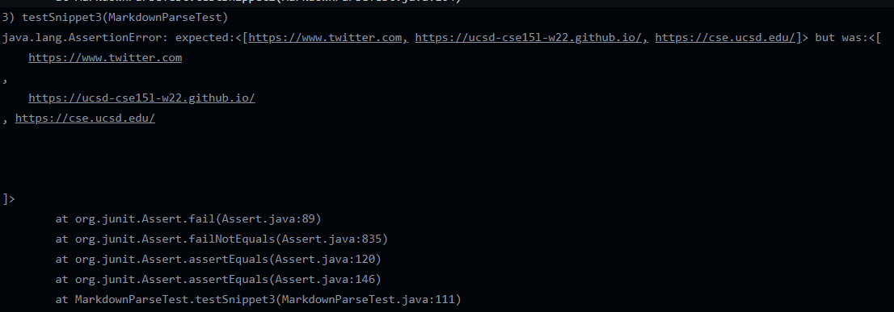<br>
My program was actually able to scrape all the URLs, and did not return any extraneous URLs, but unfortunately there were lots of newlines in each of the parsed URLs.
<h3 id="s3-fix">Fixing my markdown-parse</h3>

Fixing this error will be pretty easy. We just have to delete any newlines (represented by `\n` in Java) from the output string. This would definitely take less than 10 lines of code.
<h3 id="s3-review">Running the test on the markdown-parse I reviewed</h3>

When I ran this test on the markdown-parse I reviewed, the test failed:<br>
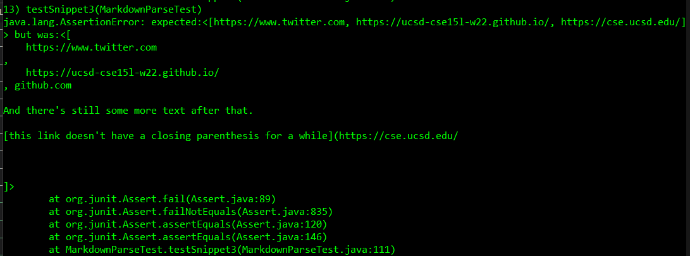
It parsed `https://www.twitter.com` and `https://ucsd-cse15l-w22.github.io` with newlines, but unfortunately parsed the entire codeblock around `https://cse.ucsd.edu` instead of just the link.
## Thus concludes my Lab Report 4.