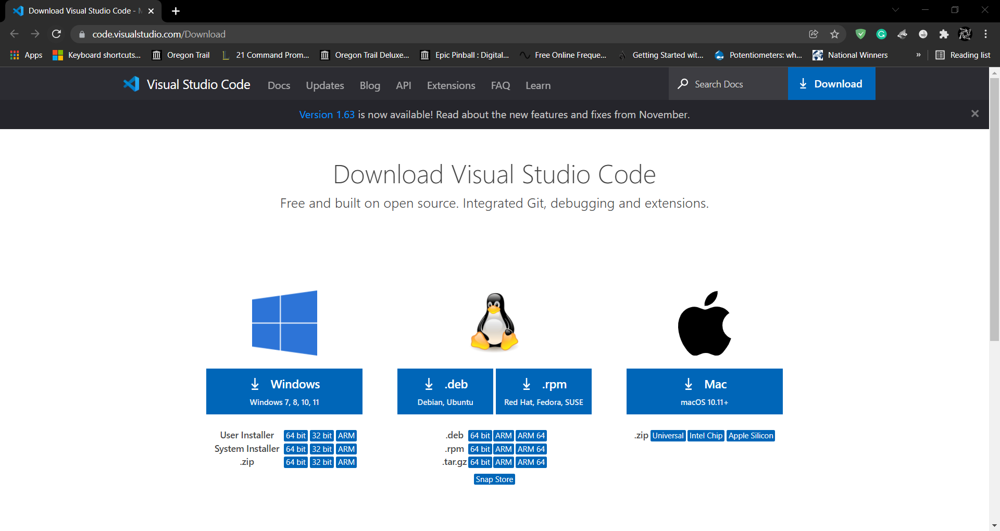
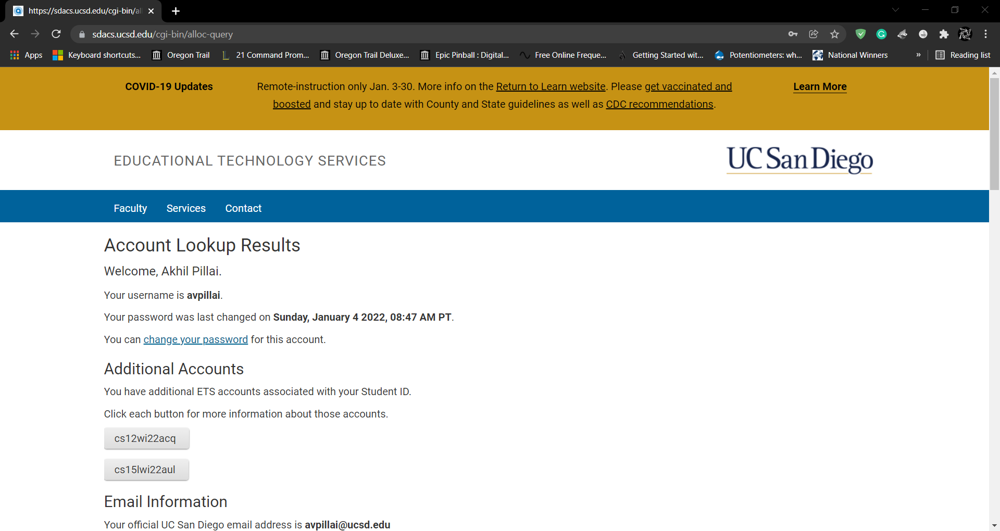
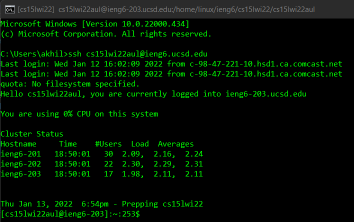
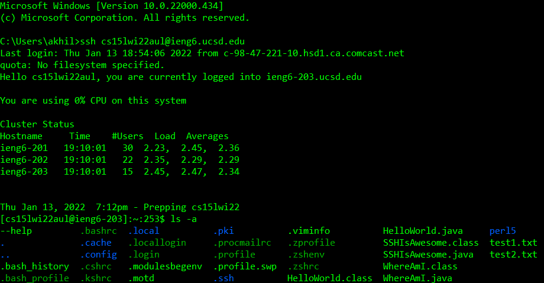
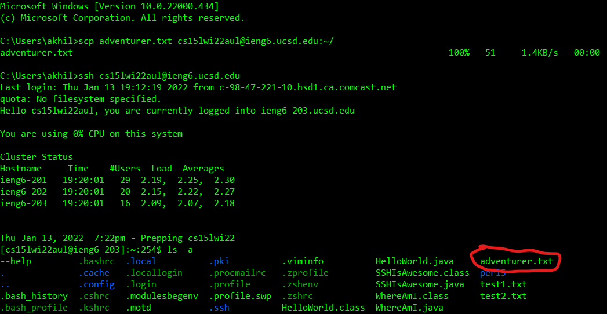
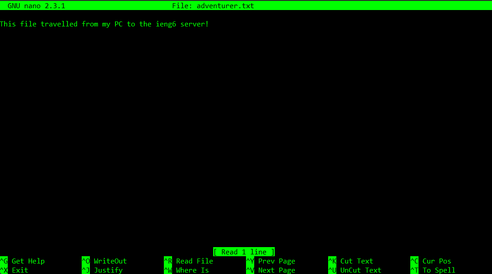
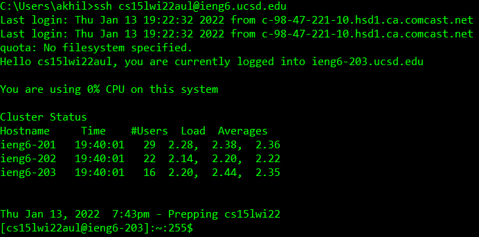
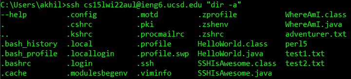
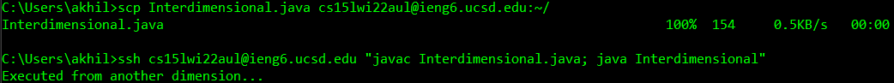

# CSE 15L Lab Report 1
## Table of Contents
- [Introduction](#introduction)
- [Step 1: Installing VSCode](#step-1-installing-vscode)
- [Step 2: Remotely Connecting](#step-2-remotely-connecting)
- [Step 3: Trying Some Commands](#step-3-trying-some-commands)
- [Step 4: Copying Files From Your Computer To The `ieng6` Server](#step-4-copying-files-from-your-computer-to-the-ieng6-server)
- [Step 5: Setting up an SSH Key](#step-5-setting-up-an-ssh-key)
- [Step 6: Optimizing Remote Running](#step-6-optimizing-remote-running)

## Introduction
This page acts as both a lab report for the first two weeks of CSE 15L during Winter 2022 and as a tutorial to connect to UCSD's `ieng6` servers.
## Step 1: Installing VSCode
Go to the [Visual Studio Code download homepage](https://code.visualstudio.com/Download)<br />and click the link for the operating system that you are using. It should look like this:<br />
<br />
This will be useful later for when we want to send and receive files with `ieng6`.
## Step 2: Remotely Connecting
Before you can remotely connect, you first have to get your course-specific account by logging into [the ETS Account Lookup page](https://sdacs.ucsd.edu/~icc/index.php). After entering your username (which is your e-mail address, without the @ucsd.edu part) and student ID (which should begin with either an 'A' or a 'U', and be followed by 8 digits), you should be taken to a screen that looks like this:<br />
<br />
Keep note of the account name that begins with `cs15`, as that is the one that is relevant to this course. It should be of the format `cs15lwi22zzz`, where `zzz` is three random letters. In my case, it was `aul`.<br /><br />
Then, you need to [install OpenSSH](https://docs.microsoft.com/en-us/windows-server/administration/openssh/openssh_install_firstuse), so that you can actually connect to the `ieng6` server.<br><br>
Now, enter VSCode and open a new terminal by clicking `Terminal`, and then `New Terminal`. In the resulting terminal that opens, enter
```
ssh cs15lwi22zzz@ieng6.ucsd.edu
```
where `zzz` is the three random letters in your account username. It should ask you if you want to continue connecting since you are trying to connect to an unknown host, to which you should enter `y` if you are interesting in using the `ieng6` servers. Enter `n` otherwise to terminate the ssh connection. It will then ask you for your password, to which you should enter your account's password (the one you just reset to).<br /><br />
You should then be taken to a Linux interface that looks like this:<br>

## Step 3: Trying Some Commands
Now that you're here, try using some Linux commands! If you don't know many linux commands, you can try the following:<br />
Command | Output
--------|--------
`ls`|Lists all visible files and folders in the current directory. Using parameters like `-a` and `-lat` allows you to see hidden files and how big each file is, respectively.
`dir`|Works the same as `ls`, including parameters. However, `dir` does not show which files are visible and hidden, and does not make directories and files distinct from each other, which `ls` does via highlighting.
`nano`|A simple Linux text editor. Just entering `nano` into the command line will allow you to write and save a new file, whereas entering `nano <filename>` will allow you to edit the existing file of that name if it exists, or a new file with that name if it does not.
`vim`|Short for Vi Improved (Vi is an old linux text editor), it is much more powerful than `nano` at the cost of being harder to use.
`mkdir`|Creates a file directory with the provided name. `mkdir` does nothing by itself, you have to enter `mkdir <directory name>` for it to do anything.
`touch`|Creates an empty file with the provided file name parameter. Does nothing without a parameter, you must use `touch <filename>` to properly use it.
`rm`|Removes the given files specified in the parameters. This means that it does nothing by itself, you have to use `rm <filename1> <filename2>` and so on and so forth. To make it remove all files in a given directory recursively, you can use `rm -rf <directory1> <directory2>...`</table>
For example, when I use `ls -a` in my home directory, I get the following:<br>
<br>
Notice how visible files are light green, hidden files are dark green, and directories are blue.
## Step 4: Copying Files From Your Computer To The `ieng6` Server
You can copy files from your computer to the `ieng6` server! This is done by using the `scp` command. To test this, first create a file by the name of `adventurer.txt` (because it's travelling from your PC to the `ieng6` server!) and save it into your command line directory. Then, in the command line, enter
```
scp adventurer.txt cs15lwi22zzz@ieng6.ucsd.edu:~/
```
where `zzz` are the three random letters in your account name. The `:~/` indicates that `adventurer.txt` should be placed in your home directory `~` on the `ieng6` server. It will ask you for your password, and after you enter it, you should see a progress bar go from empty to full, demonstrating that your file was uploaded. You can check if it went over by entering
```
ssh cs15lwi22zzz@ieng6.ucsd.edu
```
into the command line and entering your password. To check if the file is there, enter `ls -a`:<br>
<br>
and there it is! (I circled it in red) If we open it using `nano`, we can see
<br> that the contents of `adventurer.txt` went through!<br /><br />
This should work for any file, so if you feel like running your code on the server (since it has more computing power), you can send it over using `scp`!
## Step 5: Setting Up An SSH Key
You're probably tired of entering your password every time you enter `ssh` or `scp` into the command line. And you've seen my screenshots, so you know that it can be avoided. Well, this section will explain exactly how to skip the password-entering step. You can use SSH keys to make the server immediately recognize you upon connecting by giving it your public SSH key and keeping your private one for yourself. So how do you make SSH keys?<br /><br />
You first need to enter
```
ssh-keygen
```
into the command line. It will ask you if it can save to `~/.ssh/id_rsa`, where `~` is your command line home directory, to which you should just press enter. Then it will ask you if you want to use a passphrase for the file, to which you can enter your password if you want and just press enter if you don't. It will ask you to confirm by typing in that password again. It doesn't matter whether you use a password or not since you will never have to use it again on the SSH keys.<br><br>
It will then display the key fingerprint and randomart, which you don't need to jot down or anything. If you're on Windows, you should do the following extra steps:<br><br>
Open PowerShell as an administrator. Then, enter
```
Get-Service ssh-agent | Set-Service -StartupType Manual
```
to turn on the `ssh-agent` service. Then, enter
```
Start-Service ssh-agent
```
to start the service. Then, enter
```
Get-Service ssh-agent
```
to make it start running. Finally, enter
```
ssh-add ~\.ssh\id_rsa
```
to add your SSH keys to your system. Replace `~\.ssh\id_rsa` with the directory of the SSH keys you used with the system.<br><br>
Now close PowerShell if you were using Windows and connect to the `ieng6` server using
```
ssh cs15lwi22zzz@ieng6.ucsd.edu
```
and enter your password again. Then, create a directory called `.ssh` using the command
```
mkdir .ssh
```
Then, log out of the server by entering
```
logout
```
or using `Ctrl+D`. In the command line, use the command
```
scp ~\SSH_KEY_DIR\id_rsa.pub cs15lwi22zzz@ieng6.ucsd.edu:~/.ssh/authorized_keys/
```
where `SSH_KEY_DIR` is the directory in which your SSH keys are stored. For me, it was just `~\.ssh`. It will ask for your password again, which might be annoying, but you can revel in the fact that this will be the last time you *ever* need to enter your password.
Now, try logging in!
```
ssh cs15lwi22zzz@ieng6.ucsd.edu
```
<br><br>
This time, it didn't need your password!<br><br>
You can now use `scp` and `ssh` without entering your password.
## Step 6: Optimizing Remote Running
Did you know that `ssh` can be used to execute commands directly, not just to log in? For example, if you enter
```
ssh cs15lwi22zzz@ieng6.ucsd.edu "dir -a"
```
it will execute `dir -a` on the server, and print the result in the command line!<br>
<br>
In fact, if you enter multiple commands, separated by semicolons, it will execute them all in the provided order!<br><br>
For example, if we make a `java` file with the following code:
```
public class Interdimensional {
    public static void main(String[] args) {
        System.out.println("Executed from another dimension...");
    }
}
```
and save it as `Interdimensional.java` into the command line home directory, then enter
```
scp Interdimensional.java cs15lwi22zzz@ieng6.ucsd.edu:~/
```
and then enter
```
ssh cs15lwi22zzz@ieng6.ucsd.edu "javac Interdimensional.java; java Interdimensional"
```
The command will execute on the server, and then the output will be printed in the command line!<br>
<br>
The potential for this is high. You could write an extremely complex Java program on your computer, for example, and then execute it smoothly *with a single line of code* on the server! (instead of getting choppy framerates on your own PC, of course)

This concludes my lab report.
