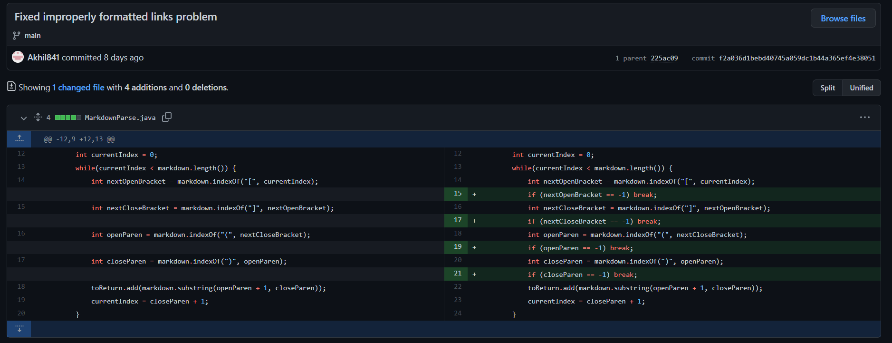
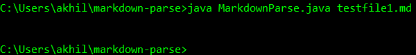
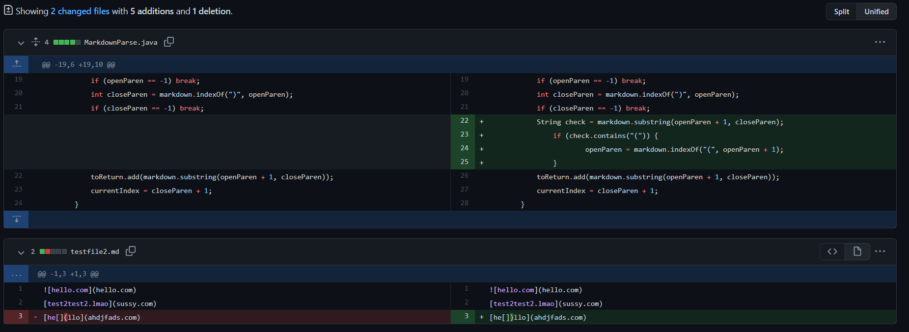
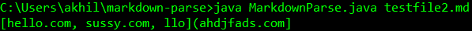
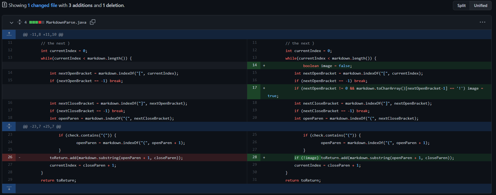
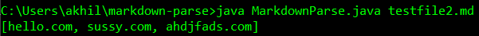

# CSE 15L Lab Report 2
## Table of Contents
## Commit 1: "Fixed improperly formatted links problem"
[Link to commit diff](https://github.com/Akhil841/markdown-parse/commit/f2a036d1bebd40745a059dc1b44a365ef4e38051) 
An image of this commit diff is below:
 
[Link to the text file that broke the program prior to this commit](https://github.com/Akhil841/markdown-parse/blob/main/testfile1.md) 
An image of the symptom of the failure-inducing input is below:
 
The bug that this commit seeks to fix is that if the program cannot find any more square brackets or parentheses (and only finds text), it constantly sets `currentIndex` to `-1`, and since the while loop operates with condition `currentIndex < markdown.length()`, the loop will never end. The failure-inducing input addresses this by having lots of parentheses and square brackets followed by text. The symptom of this bug is that when the program is run, it shows black text forever, until the program is forcefully terminated by the user entering `Ctrl+C`. We fixed this problem by making the while loop end if any of `nextOpenBracket`, `nextCloseBracket`, `openParen`, or `closeParen` are `-1`.
## Commit 2: "Square and circle brackets (sic) can be in the hyperlink text"
[Link to commit diff](https://github.com/Akhil841/markdown-parse/commit/fa7f0188d608d5f173a6b7af8cff70c97caf7c10) 
An image of this commit diff is below:
 
[Link to the text file that broke the program prior to this commit](https://github.com/Akhil841/markdown-parse/blob/main/testfile2.md) 
An image of the symptom of the failure-inducing input is below:
 
The bug that this commit seeks to fix is that if a hyperlink's text contains the characters `[`, `]`, or `(`, the corresponding scraped link will be meaningless garbage. The failure-inducing input addresses this problem by containing a hyperlink whose text contains `[`, `]`, *and* `(`. The symptom image above demonstrates this failure, where the input `[he` returns `llo](ahdjfads.com`, which is not a valid URL, instead of the expected `ahdjfads.com`. We fixed this problem by checking if the string determined to be a link contains the character `(`, in which case the link is determined to start at the character *after* the `(`.
## Commit 3: "No longer adds images to list of links"
[Link to commit diff](https://github.com/Akhil841/markdown-parse/commit/af2cc7de7bedf446d633befae5b5950ffbdc803f) 
An image of this commit diff is below:

[Link to the text file that broke the program prior to this commit](https://github.com/Akhil841/markdown-parse/blob/main/testfile2.md) 
An image of the symptom of the failure-inducing input is below:
 
The bug that this commit seeks to fix is that image source URLs are added to the list of links that is returned, despite the fact that it was specified in advance that the program should not return image links. The failure-inducing input addresses this problem by including an image in the `.md` file: ``. The symptom is that `hello.com` is returned along with the other links, despite the fact that it is an image source rather than a hyperlink in the file. We solved this problem by checking if the first character of the markdown hyperlink was `!` (which indicates that the hyperlink is an image rather than a link), and not returning it if that was the case.