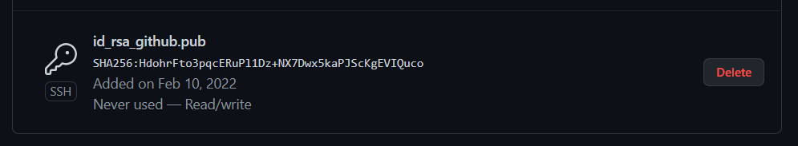
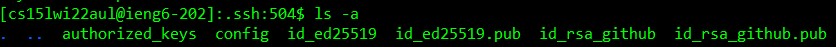
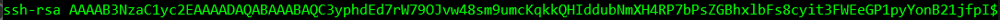
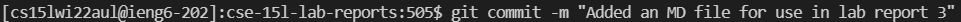
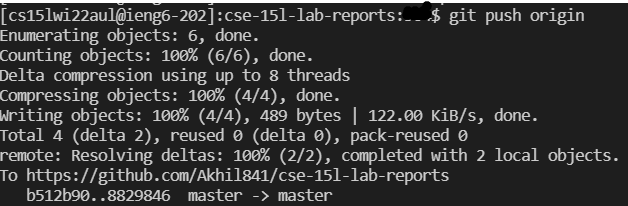

# CSE 15L Lab Report 3
## I am reporting on Group Choice Option 2
## Table of Contents
- [Public Key](#public-key)
- [Private Key](#private-key)
- [Using `git` commands from `ieng6`](#using-git-commands-from-ieng6)
- [Commit link](#commit-link)
## Public Key
Here is my public SSH key in GitHub: 

Here it is on my `ieng6` account, in the directory:
 
It's the file named `id_rsa_github.pub`.  
Here are the contents of my public key:
 
The `$` indicates that there is more text past the edge of the window, but it would be cumbersome to get the entire thing into one image.
## Private Key
Here is my private SSH key in on my `ieng6` account: 
 
It's the file named `id_rsa_github`.
## Using `git` commands from `ieng6`
I added [this](https://github.com/Akhil841/cse-15l-lab-reports/blob/master/reports/lr3-commited-from-ieng6.md) file to the repository from `ieng6`. 
You can access it as a webpage [here!](lr3-commited-from-ieng6.md)
I first commited the file locally:
 
I then pushed it to the repository: 

## Commit link
You can find the link to this commit [here](https://github.com/Akhil841/cse-15l-lab-reports/commit/88298462d93364c533b1e27c5fdb49d2922c5a0c).
