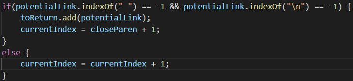

# CSE 15L Lab Report 5
## Table of Contents
- [Introduction](#introduction)
- [Test 1](#test-1)
   - [Comparing Tests](#test-1-comparing-tests)
   - [The bug in the professor's code](#test-1-bug-in-code)
- [Test 2](#test-2)
   - [Comparing Tests](#test-2-comparing-tests)
   - [The bug in my code](#test-2-bug-in-code)
- [Closing remarks for CSE 15L](#closing-remarks)
## Introduction
When I compared Prof. Joe Politz's implementation of markdown-parse against my own, using the CommonMark spec tests, there were numerous differences in the output of `getLinks()` between the two. In this lab report I will discuss two of them.<br><br>

To compare the the two implementations of markdown-parse, I first ran the professor's markdown-parse against the CommonMark spec tests using a bash for loop. I stored these results in a text file `results.txt`. I then ran my own markdown-parse against the CommonMark spec tests using a bash for loop, the results of which I stored in another text file `results2.txt`. I then used the `diff` command to get all the differences between `results.txt` and `results2.txt`, which is all of the differences between the professor's implementation and my own.
<h2 id="test-1">Test 1</h2>
<h3 id="test-1-comparing-tests">Comparing Tests</h3>

In test file `22.md`, the markdown looked like this:<br>
<br>
My code returned
```
[/bar\* "ti\*tle"]
```
and Prof. Politz's implementation returned
```
[]
```
The expected output is text `foo` that links to `/bar\*` with title `ti\*tle`, according to Visual Studio Code's Markdown preview. TTherefore neither of our implementations are correct.
<h3 id="test-1-bug-in-code">The bug in the professor's code</h3>

The professor's implementation of markdown-parse contains code to prevent a link with newlines of spaces in it from being added to the output of `getLinks`:<br>

The problem is that sometimes links have a space in them to allow a title to be placed next to the link. This is what happened here: the space in `/bar\* ti\*tle` was not a faulty link. Instead, the link led to `/bar\*` and had title `ti\*tle`. However, Prof. Politz's code simply ignores potential links with spaces in them instead of only taking the link, and thus it had a bad result. To fix this, we can change the code to only take the link (i.e. substring from the beginning to the first space of `potentialLink`) instead of outright ignoring the potential link.
<h2 id="test-2">Test 2</h2>
<h3 id="test-2-comparing-tests">Comparing Tests</h3>

In test file `489.md`, the markdown looked like this:<br>
<br>
My code returned
```
[foo
bar]
```
and Prof. Politz's returned
```
[]
```
The expected output, according to Visual Studio Code Preview, is just `[link](foo bar)` in text form, and thus there are no links. Therefore Prof. Politz's implementation is correct while mine is not.
<h3 id="test-2-bug-in-code">The bug in my code</h3>

The reason my code did not return the correct link is not due to a fault in a section of my code, but rather a lack of code for one specific edge case: newlines. As shown earlier, Prof. Politz's code contains an `if` statement that prevents links with newlines from being added. My code, however, has no such detection, and thus it added `[foo\nbar]` to the result of `getLinks()` when it should not have. As you might expect, this has a simple fix of ignoring links with a `\n` newline character via `if` statement, similar to what the professor has.

<h2 id="closing-remarks">Closing remarks for CSE 15L</h2>

This concludes my final lab report for CSE 15L. This has been my favorite CSE class thus far, so I would like to thank Professor Joe Politz and all of this class's TAs and other staff for such a great experience.